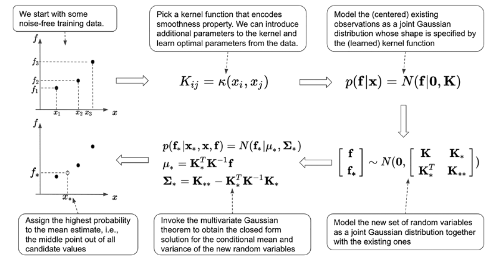

# Bayesian Optimization

Bayesian optimization is a technique to optimize (i.e. either minimize or maximize) an expensive-to-evaluate unknown
scalar function $f:A\rightarrow \mathbb{R}$, where $A \in \mathbb{R}^N$ is an $N$-dimensional bounded
domain, using a probabilistic model.

Unlike traditional methods, like grid search or random search, which optimize the objective function by exploring the
hyperparameter space in a deterministic or pre-defined way, Bayesian optimization builds a probabilistic model of the
function and uses it to decide where to evaluate next in the hyperparameter space. More specifically, it is based on an
iterative application of [Bayes inference](bayesian_inference.md).

---

### Qualitative Introduction

As any predictive algorithm, Bayesian optimization must start somewhere, and it starts with the **prior
distribution**, $p(f)$, which encodes our knowledge about and experience with the system of interest into what we
consider to be a plausible objective function $f$ before observing any data. If there is no prior knowledge about the
process, the **prior distribution** could be a uniform probability distribution across the whole co-domain, ideally
from $-\infty$ to $+\infty$.

Once a prior has been established, the next stage of inference is to refine the initial belief, or **likelihood**, in
light of newly observed data. Assume making an observation of the objective function at $\mathbf{x}$, revealing a
measurement $y = f(\mathbf{x}) + \epsilon$ where $\epsilon$ is random noise. A common practice is to treat the noise as
a random normal variable with zero mean and fixed variance, that is $\epsilon \sim \mathcal{N}(0, \sigma_n^2)$, such
that the probability of observing a value $y$ is:
$$
p(y \vert \mathbf{x}, f, \sigma_n) = \mathcal{N}\left(f(\mathbf{x}), \sigma_n^2\right)
$$
This means that for a specific location $\mathbf{x}$, the actual observation $y$ is treated as a normally distributed
random variable with mean $f(\mathbf{x})$ and variance $\sigma^2$. Given the observed value $y$, the **posterior
predictive distribution** $p(y' \vert \mathcal{D})$, where $\mathcal{D}$ is the set of the previously observed
points $\{y\}$ can be calculated by appealing to Bayes’ theorem.

At this point, the induction is trivial: to incorporate a new observation, what was our posterior serves as the prior in
the context of the new information. Multiplying the new prior by the likelihood and renormalizing yields a new
posterior. We may continue in this manner as desired.

---

### Algorithm: Bayesian Optimization for Gaussian Processes

The following figure illustrates the Bayesian optimization algorithm for an objective
function $f: \mathbb{R}^N \rightarrow \mathbb{R}$ modeled as a [Gaussian Process](gaussian_process.md).

**Figure 1**: Bayesian Optimization process.

Given:

- The **Kernel Function** $k(\mathbf{x}, \mathbf{x}^\prime): \mathbb{R}^N \rightarrow \mathbb{R}$: The function to
  calculate the covariance matrix $K$.
- The **Hyperparameter Space** $X \in \mathbb{R}^N$: The space of possible inputs (real-valued,
  bounded).
- The **Acquisition Function** $A(\mathbf{x}): \mathbb{R}^N \rightarrow \mathbb{R}^1$: A function used to decide the
  next
  point to evaluate.
- **Initial Observations**: A relatively small set of $n$ initial data
  points
  $$
  D_{0} = \{(\mathbf{x}_1, y_1), (\mathbf{x}_2, y_2), \dots, (\mathbf{x}_n, y_n)\} =
  \left\{
  \left( \left[ \begin{matrix} x_{10} \\ x_{11} \\ \cdots \\ x_{1N} \end{matrix} \right], y_1\right)
  \left( \left[\begin{matrix} x_{20} \\ x_{21} \\ \cdots \\ x_{2N} \end{matrix}\right], y_2 \right)
  \cdots,
  \left( \left[\begin{matrix} x_{n0} \\ x_{n1} \\ \cdots \\ x_{nN} \end{matrix}\right], y_n \right)
  \right\}
  $$
  where each $y_i = f(\mathbf{x}_i) + \epsilon$ is the observed value of the objective function at
  location $\mathbf{x}_i$. These
  points can be chosen using Random Sampling, [Latin Hypercube Sampling](latin_hypercube_sampling.md) (LHS), or Grid
  Search.

- The **Stopping Criteria**: The maximum number of evaluations $n_\mathrm{max}$ or a stopping condition based on
  convergence, such as $f(\mathbf{x}_*) - f(\mathbf{x}) < \delta$, where $\delta$ is
  a very small value.

The optimization process follows five main steps:

1. **Initialize Gaussian Process (GP)**:  
   Fit a Gaussian Process model to the initial observations $D_0$ to estimate the hyperparameters of the GP model (
   e.g., length scale(s), variance). This is done by first calculating the covariance matrix $K$ with the choice of
   kernel, and then maximizing the (logarithmic) [Maximum Likelihood Estimate](maximum_likelihood_estimation.md) for the
   model, i.e.:
   $$
   \hat{\mathbf{\theta}} = \arg\max_\theta\log{p(\mathbf{f} \vert \mathbf{x})}
   $$
   where $p(\mathbf{f} \vert \mathbf{x}) = \mathcal{N}(\mathbf{f} \vert \mathbf{\mu}, \mathbf{K})$ is a multivariate
   normal distribution, and $\theta$ is the set of parameters to find. In particular,
   $$
   \log p(\mathbf{f} \vert x) = -\frac{1}{2} (\mathbf{f} - \mathbf{\mu})^T \left(\mathbf{K} +
   \sigma_n^2 \mathbf{I} \right)^{-1} (\mathbf{f} - \mathbf{\mu}) - \frac{1}{2} \log |\mathbf{K} + \sigma_n^2 \mathbf{I}| -
   \frac{n}{2} \log(2\pi)
   $$
2. **Find Next Data Point $\mathbf{x}_*$**:  
   Maximize the acquisition function $A(\mathbf{x})$ over the input domain to find the next point $\mathbf{x}_*$ where
   to
   evaluate the objective function. In formula:
   $$
   \mathbf{x}_* = \arg\max_{\mathbf{x} \in X} A(\mathbf{x})
   $$
3. **Evaluate the Objective Function**:  
   Evaluate the objective function at the newly selected point, $y_* = f(\mathbf{x}_*)$, then add the new
   observation $\left(\mathbf{x}_*, y_* \right)$ to the existing dataset $\mathbf{f}$. Now, model the new set of random
   variables as joint Gaussian distribution together with the existing ones.
   $$
   \begin{bmatrix} \mathbf{f} \\ \mathbf{f}_* \end{bmatrix} \sim
   \mathcal{N}\left(
   \begin{bmatrix} \mathbf{\mu} \\ \mu_* \end{bmatrix},
   \begin{bmatrix} \mathbf{K} & \mathbf{K}_* \\ \mathbf{K}_*^\mathrm{T} & \mathbf{K}_{**}\end{bmatrix} \right)
   $$
4. **Update the Model**:  
   After evaluating the objective function at $\mathbf{x}_*$, update the Gaussian Process posterior $P(H \vert E)$ with
   the new data point. This involves calculating the mean function and the covariance function based on the extended
   dataset:
   $$
   m_{t+1}(\mathbf{x}) = m_t(\mathbf{x}) + \mathbf{k}(\mathbf{x}_*,X) \left(K + \sigma_n^2 I \right)^{-1} \mathbf{y}
   $$
   $$
   \sigma^2(\mathbf{x}) = \mathbf{k}(\mathbf{x}_*,X) - \left(K + \sigma_n^2 I \right)^{-1} \mathbf{k}(X, \mathbf{x})
   $$
   where $\mathbf{k}$ is the vector of covariances between the new point $\mathbf{x}_*$ and all previously observed
   points $X$.
5. **Stopping Criteria**:
   Repeat steps 2–4 iteratively until a stopping criterion is met, e.g. when a predefined number of function evaluations
   is reached or when the improvement in the objective function becomes negligible.

---

### Data Points

The experimental data points fora Bayesian optimization are assumed to include noise.
$$
y_i = f\left( x_i \right) + \epsilon_i
$$
where
$$
\epsilon_i \sim \mathcal{N}\left(0, \sigma_n^2 \right)
$$
is the normally distributed noise associated to the *i*-th measurement, having mean $\mu_n = 0$ and
variance $\sigma_n^2$. When $n$ data points are available, the *covariance matrix* $K \in [n\times n]$

---

### The Posterior Function $\mathscr{L}_*$

When adding a new test point $x_\mathrm{next}$, so that $\mathscr{L}\left( x_\mathrm{next} \right)$ is the function
evaluated at the new point, the posterior function, i.e. the new function evaluated after adding the
point $x_\mathrm{next}$, also follows a multivariate gaussian distribution
$$
\begin{bmatrix} y \\ f \left( x_* \right) \end{bmatrix} \sim
\mathcal{N}\left(\mathbf{0}, \begin{bmatrix} K\left(X, X \right) +\sigma_n^2I & K \left(X, x_* \right)
\\ K \left(x_*, X \right) & K\left( x_*, x_* \right) \end{bmatrix} \right)
$$
where $\sigma_n^2$ is due to the Gaussian noise of the experimental data points.

---

### Acquisition Function

The acquisition function uses the posterior mean and posterior variance to identify the next point $x$ to evaluate.
A popular acquisition function is the Expected Improvement ($\mathrm{EI}$) function.
$$
\mathrm{EI}(x) = \left[ f_\mathrm{best} - \mu(x)\right] F\left(\eta \right) + \sigma(x)f(\eta)
$$
where $\eta = \frac{f_\mathrm{best}-\mu(x)}{\sigma(x)}$ is the normalized improvement over the best observed value.
Here, $f_\mathrm{best} - \mu(x)$ is the difference between the current best value and the predicted mean at $x$,
evaluated before adding the new data point $x_\mathrm{next}$ to the dataset $X$.

---

### Posterior Mean $\mu_*(x)$

The posterior mean is the prediction of the value of the objective function at $x$, is given by:
$$
m(\mathbf{x}_*) = \mathbf{k}(\mathbf{x}_*)^T\left[K +\sigma_n^2 I \right]^{-1}\mathbf{y}
$$
where $\mathbf{k}(\mathbf{x}_*)$ is a column vector where each element is the covariance between the new
point $\mathbf{x}_*$ and all points in the dataset $\mathbf{x}_i$.