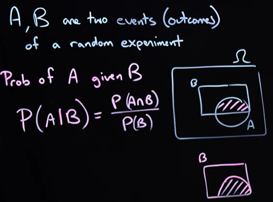

# Conditional Probability

Given two events $A$ and $B$, and the probabilities $P(A)$ and $P(B)$ that these events occur, the conditional
probability $P(A \mid B)$, representing the probability that event $A$ occurs given that event $B$ has already occurred,
is defined as:

$$
P(A \mid B) = \frac{P(A \cap B)}{P(B)}
$$

where $P(A \cap B)$ is the probability that both events $A$ and $B$ occur simultaneously.
A geometric interpretation of this probability is illustrated in [Figure 1](#conditional_probability).
Here, $P(A \mid B)$ can be understood as a "zoomed-in" probability, focusing on event $A$ within the context of
event $B$. Geometrically, this corresponds to dividing the area representing $P(A \cap B)$ by the area
representing $P(B)$.

    
    
<b>Figure 1:</b> Graphical interpretation of conditional probability.

Similarly, the inverse conditional probability that event $B$ happens, given that event $A$ has already occurred, is

$$
P(B \mid A) = \frac{P(B \cap A)}{P(A)}
$$

Combining $P(A \mid B)$ and $P(B \mid A)$, the following important identity can be easily demonstrated:

$$
P(A \mid B) P(B) = P(B \mid A) P(A)
$$

This identity is used to make inference, or determining the "inverse" probability.

