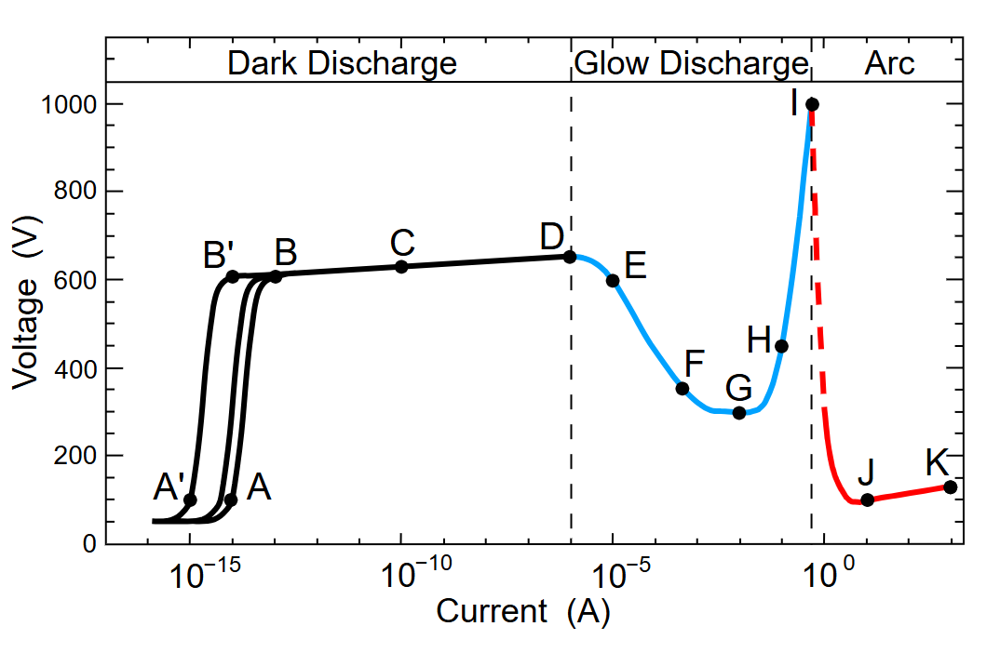
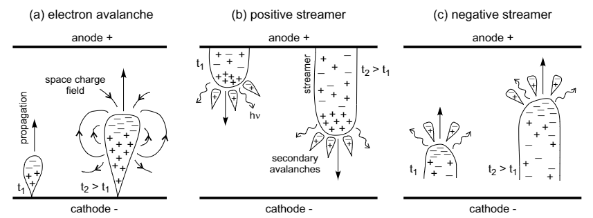
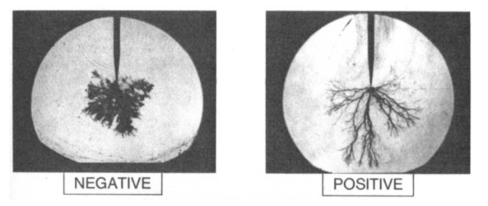

# Physics

## Table of Contents

1. [Discharge in high pressure gases](#discharges-in-high-pressure-gas)
2. [Discharge in dielectric solids](#discharges-in-dielectric-solids)
3. [Discharge in dielectric liquids](#discharges-in-dielectric-liquids)

EDM is designed to operate under unstable electric discharge conditions, i.e. in the transition phase occurring right
before the formation of an electric arc. In fact, if the power source is capable of supporting the discharge current
over a certain amount of time, the spark
will naturally transform into an arc, and arcs erode cathodes and anodes by leaving small craters on their surfaces.
This is something to avoid, especially when EDM is used to achieve smooth surfaces. The arcing phenomenon during EDM is
generally avoided by stopping the discharge as soon as the voltage between the electrodes reaches a value below a fixed
threshold, typically $15-20\,\mathrm{V}$. Other arc detection methods exist, based on the measurement of the time
lag between the voltage application and the breakdown, on the measurement of the ignition voltage value, or on the
measurement of the voltage descending flank at the breakdown. Since the plasma state in a high pressure arc
column is found to be relatively similar to that in a spark channel, it is of interest understanding arc phenomena to
understand EDM processes.

    
    
<b>Figure 1: </b>The dotted line in the arc region corresponds to the unstable, transitional phase of the electric discharge
that is used in EDM. If an arc is established, the amount of current can significantly damage the workpiece and/or the
electrode.

## Discharges in high pressure gas

The formation of a spark in high pressure (e.g., atmospheric) is typically described in terms of streamers—fast-moving
ionization fronts that can develop into complex, tree-like structures or other shapes, extending from one electrode to
the other.
A streamer is initiated by an electron avalanche originating at the cathode.
The initial free electrons are typically emitted by the cathode via \textbf{thermionic emission}, \textbf{Field
emission (tunneling)}, or \textbf{Thermionic field emission (Fowler Nordheim tunneling)}, in addition to those already
present because of photo-ionization of the gas mixture via cosmic rays.
The electron avalanche generates a space charge—a region with a high density of charged particles that can be treated as
a continuum—whose center drifts in the applied electric field. Due to the voltage difference between the electrodes, the
space charge becomes polarized, effectively screening (reducing) the external field within its region. As the avalanche
process continues, the space charge region expands, and so does the space charge field. Eventually, the charge density
within the avalanche creates an electric field at its outer edge comparable to the external field. At this point, the
space charge field effectively screens the external field within the avalanche region while simultaneously enhancing the
field at the outer edges. This enhanced field at the avalanche front induces a secondary electron avalanche ahead of the
initial one.
Depending on the properties of the gas and the external field, two scenarios may occur: the formation of a positive
streamer, which extends from the anode (+) to the cathode (-), or a negative streamer, which extends from the
cathode (-) to the anode (+).

**Positive streamers** occur when free electrons ahead of the primary avalanche front are generated through
photoionization, where photons emitted by excited ions within the space charge ionize neutral gas molecules, producing
new free electrons and positive ions. The newly created electrons are then accelerated by the locally enhanced electric
field, triggering further ionization and sustaining the streamer’s propagation. Simultaneously, the positive ions left
behind drift toward the cathode, leading to the development of a positive streamer.

**Negative streamers** form when the secondary electrons arise entirely from the high local electric field at the
front of the primary avalanche, without requiring photoionization. In this case, fast-moving electrons directly ionize
neutral molecules ahead of the streamer, allowing it to propagate toward the anode.

    
    
<b>Figure 2:</b> The dotted line in the arc region corresponds to the unstable, transitional phase of the electric discharge
that is used in EDM. If an arc is established, the amount of current can significantly damage the workpiece and/or the
electrode.

Depending on the distance between the electrodes and the magnitude of the external voltage, the streamers can either
form before or only after the space charge has extended all the way across the gap between the electrodes.

For **large gaps and/or strong external voltages**, the space charge field to induce breakdown has space and time
enough to form within the gap, and the physics is as described above.

For **small gaps and/or moderate weak external voltages**, the space charge field does not become strong enough to
create an ionized region before extending all the way towards the anode. Once it reaches the anode, the field between
the front of the primary avalanche and the anode may be then strong enough to initiate a secondary avalanche via
electrons released by photo-ionization. Therefore, the streamer is positive.

## Discharges in dielectric solids

## Discharges in dielectric liquids

The breakdown in dielectric liquids occurs via the formation of \textit{streamers}, similarly to what happens in
high-pressure gases, but with some differences. Contrary to discharge in gases, the structure and propagation speed of
positive and negative streamers are different: the positive streamer is “filamentary” and
“fast” ($\sim \SIrange{1}{10}{\kilo\meter\per\second}$), and the negative streamer is “bushy” and
“slow” ($\sim\SI{100}{\meter\per\second}$).

    
    
<b>Figure 3:</b> The dotted line in the arc region corresponds to the unstable, transitional phase of the electric discharge
that is used in EDM. If an arc is established, the amount of current can significantly damage the workpiece and/or the
electrode.

In liquid dielectrics, electron scattering events occur more frequently than in gases, preventing electrons from gaining
enough kinetic energy to ionize liquid molecules directly. As a result, it is widely accepted that the primary electron
avalanche occurs in regions of lower density, such as pre-existing microbubbles. These bubbles form due to thermodynamic
fluctuations in the liquid or result from localized heating near the electrodes, where short electron avalanches deposit
energy following electron extraction.
Supporting this hypothesis, experiments show that increasing the pressure suppresses streamer development and raises the
breakdown voltage, indicating that lower-density regions (such as bubbles) play a crucial role in discharge initiation.
Once the primary electron avalanche forms, electrons at the front transfer energy to the surrounding liquid, locally
heating it and further reducing its density, thereby expanding the bubble. As the bubble grows, the streamer develops
similarly to those in high-pressure gases, propagating through successive ionization and charge transport processes.
When the streamer reaches the other electrode, a reverse ionizing front is observed as in gases, starting from the
reached electrode and going back towards the initial electrode.
The characteristics of the streamers depend on the voltage, the gap size, the electrodes material, geometry and surface,
the liquid pressure, viscosity, density, conductivity, temperature, purity, etc.