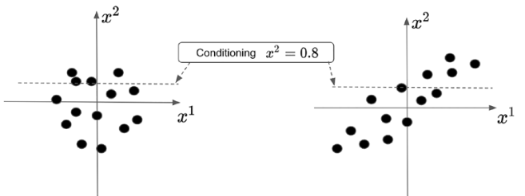

# Multivariate Normal Distribution

Given two normally distributed variables and independent variables $x_1=\mathcal{N}\left(\mu_1, \sigma^2_1 \right)$
and $x_2=\mathcal{N}\left(\mu_2, \sigma^2_2 \right)$, their joint distribution
$P\left(x_1, x_2\right) = P\left(x_1\right) P\left(x_2\right)$ is:
$$\begin{align}
P\left(x_1, x_2\right) &= \frac{1}{\sqrt{2 \pi \sigma_1^2}} \exp\left({-\frac{\left(x_1 - \mu_1\right)^2}{2\sigma_1^2}}\right)
\frac{1}{\sqrt{2 \pi \sigma_2^2}} \exp\left({-\frac{\left(x_2 - \mu_2\right)^2}{2\sigma_2^2}}\right) \\ &=
\frac{1}{2 \pi \sigma_1 \sigma_2} \exp\left({-\frac{1}{2} \left( \mathbf{x} - \mathbf{\mu} \right)^\mathrm{T} \Sigma^{-1} \left(\mathbf{x} - \mathbf{\mu} \right)}\right)
\end{align}$$

where $\Sigma = \begin{bmatrix} \sigma_1^2 & 0 \\ 0 & \sigma_2^2\end{bmatrix}$ is the (diagonal) covariance matrix. In
general, given $N$ non-necessarily independent normally distributed variables $\{x_1, x_2, \dots, x_N\}$, the
corresponding multivariate normal distribution is:

$$
P(x_1, x_2, \dots, x_N)=
\frac{1}{\left(2 \pi\right)^{N/2} \det{\Sigma}}
\exp\left({-\frac{1}{2} \left( \mathbf{x} - \mathbf{\mu} \right)^\mathrm{T} \Sigma^{-1} \left(\mathbf{x} - \mathbf{\mu} \right)}\right)
$$
where the covariance
matrix $\Sigma = \begin{bmatrix} \sigma_1^2 & 0 & \dots & 0 \\ 0 & \sigma_2^2 & \dots & 0 \\ \vdots & \vdots & \ddots & \vdots \\ 0 & 0 & \dots & \sigma_N^2\end{bmatrix}$
describes the correlation between the $N$ variables. It also provides information about the conditional
probability distribution, e.g. the probability distribution of $x_1$ given $x_2=a$, that is $p(x_1 \vert x_2=a)$. This
is again a normal distribution, with conditioned mean $\mu_{1 \vert 2}$ and variance $\sigma_{1 \vert 2}^2$. In formula:

$$
p\left(x_1 \vert x_2 = a \right) = \mathcal{N} \left(x_1 \vert \mu_{1 \vert 2}, K_{1 \vert 2} \right)
$$

where the conditional posterior mean and variance are

$$\begin{align}
\mu_{1 \vert 2} &= \mu_1+K_{12} K_{22}^{-1}\left(a - \mu_2 \right) \\
K_{1\vert 2} &= K_{11} - K_{12}K_{22}^{-1}K_{21}
\end{align}$$

This can be proved by explicitly setting $x_2=a$ in $p(x_1, x_2)$ and recognizing that the new distribution is normal
with new mean and variance values.

  
  <figcaption>Figure: Representative bivariate normal distributions: (Left) Independent variables. (Right) Correlated variables.</figcaption>

lknl