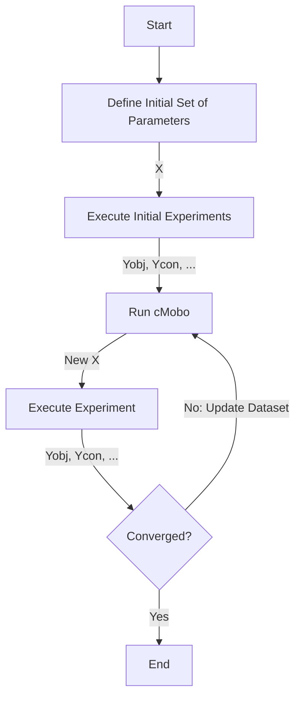

# Readme

+ [Bayes Theorem](documents/conditional_probability.md)
+ [Bayesian Inference](documents/bayesian_inference.md)
+ [Bayesian Optimization](documents/bayesian_optimization.md)

+ [Gaussian Processes](documents/gaussian_process.md)
+ [Maximum Likelihood Estimation](documents/maximum_likelihood_estimation.md)

## Data Input Format
The input data format for cMOBO is a $\mathbf{Z}$ matrix in a CVS file. The matrix is organized as follows:

$$
\mathbf{Z} = \left[ \mathbf{X} \; \middle| \; \mathbf{Y}_{\mathrm{obj}} \; \middle| \; \mathbf{Y}_{\mathrm{obj, \sigma}} \; \middle| \; \mathbf{Y}_{\text{con}} \; \middle| \; \mathbf{Y}_{\mathrm{con, \sigma}} \right]
$$

- $ \mathbf{X} \in \mathbb{R}^{n \times d} $: Input data (design variables)
- $ \mathbf{Y}_{\mathrm{obj}} \in \mathbb{R}^{n \times m} $: Objective values
- $ \mathbf{Y}_{\mathrm{obj, \sigma}} \in \mathbb{R}^{n \times m} $: Variance of objective values (optional)
- $ \mathbf{Y}_{\mathrm{con}} \in \mathbb{R}^{n \times c} $: Constraint values (optional)
- $ \mathbf{Y}_{\mathrm{con, \sigma}} \in \mathbb{R}^{n \times c} $: Variance of constraint values (optional)

where 
- $n$ is the number of experiments.
- $d$ is the number of parameters.
- $m$ is the number of observable objectives.
- $c$ is the number of observable constraints.

## Data Output Format
Model:
Dataset:
Figures

## Flowchart

