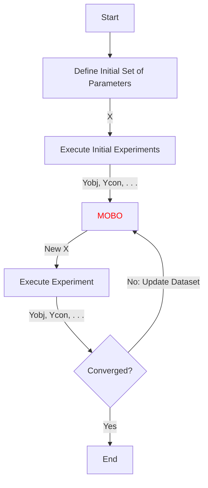

# pyMOBO - A Package for Experimental Multi Objective Bayesian Optimization

pyMOBO is a Python package based on BoTorch, designed to facilitate experimental Multi-Objective Bayesian Optimization (
MOBO). It provides
a flexible framework for optimizing multiple competing objectives simultaneously while considering experimental
constraints. pyMOBO implements Bayesian optimization techniques using Gaussian Processes to explore
hyperparameter spaces and find Pareto-optimal solutions. pyMOBO is particularly useful for scenarios where experiments
are
costly or time-consuming, as it minimizes the number of experiments needed by making informed decisions about which
parameters to test next based on previous observations.

## Experimental Flowchart

MOBO is designed for easy integration within an experimental optimization pipeline. It receives as input the results of
the experiments in a matrix format (see [Data Input Format](#data-input-format)), and returns as output a new set of
parameters for the next experiment to execute.
MOBO is designed to work in $q$-batch, where a $q$-batch is a set of $q$ parameters-observable pairs. In practice, it is
capable of generating a number $q$ of new parameter sets per optimization loop.

## Data Input Format

The input data format for MOBO is a $\mathbf{Z}$ matrix in a CVS file. The $\mathbf{Z}$ matrix is organized as follows:

$$
\mathbf{Z} = \left[ \mathbf{X} \; \middle| \; \mathbf{Y}_{\mathrm{obj}} \; \middle| \; \mathbf{Y}_{\mathrm{obj, \sigma}} \; \middle| \; \mathbf{Y}_{\text{con}} \; \middle| \; \mathbf{Y}_{\mathrm{con, \sigma}} \right]
$$

with

- $ \mathbf{X} \in \mathbb{R}^{n \times d} $: Input data or parameters
- $ \mathbf{Y}_{\mathrm{obj}} \in \mathbb{R}^{n \times m} $: Objective values
- $ \mathbf{Y}_{\mathrm{obj, \sigma}} \in \mathbb{R}^{n \times m} $: Variance of objective values (optional)
- $ \mathbf{Y}_{\mathrm{con}} \in \mathbb{R}^{n \times c} $: Constraint values (optional)
- $ \mathbf{Y}_{\mathrm{con, \sigma}} \in \mathbb{R}^{n \times c} $: Variance of constraint values (optional)

where

- $n$ is the number of observations
- $d$ is the number of parameters or input space dimension
- $m$ is the number of observable objectives
- $c$ is the number of observable constraints

## Data Output Format

MOBO allows exporting a class instance in binary format (pickle), and the object's dataset in CSV file (
see [Data Input Format](#data-input-format)).

## Results Visualization

MOBO supports visualization of multi objective optimization processes, including accepted and rejected observations, and
the pareto front.

## Tutorials

The following tutorials are currently available ...

- [Branin-Currin](test/unconstrained_BraninCurrin.py) unconstrained bi-objective optimization
- [C2DTLZ2](test/constrained_C2DTLZ2.py) constrained bi-objective optimization
