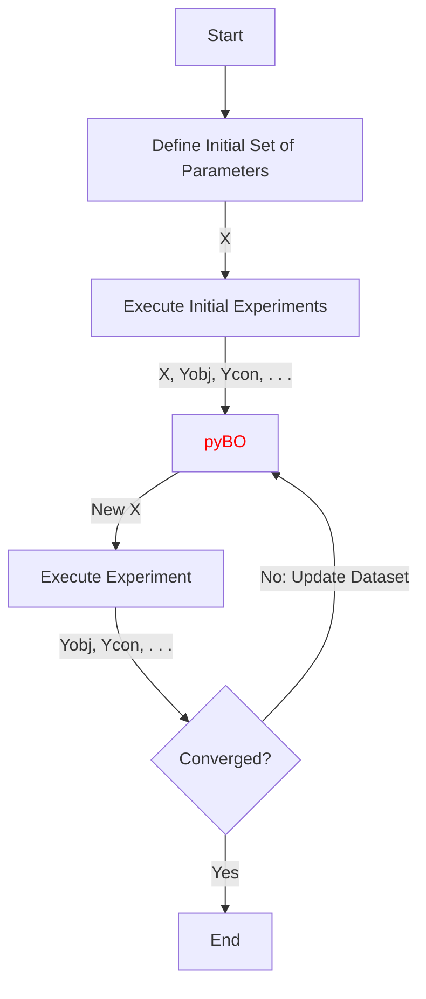
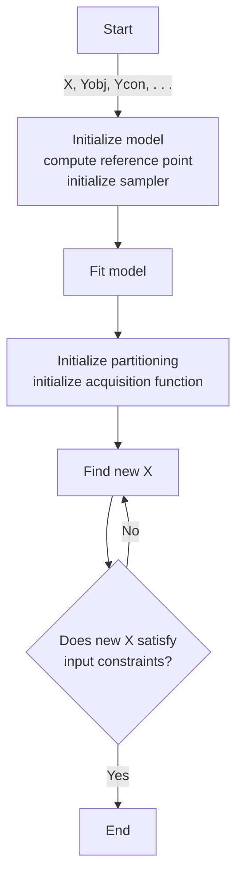

# pyBO — A Python Library for Bayesian Optimization
`pyBO` is a Python library for Multi-Objective Bayesian Optimization (MOBO). Built on top of BoTorch and using Gaussian Processes, it provides a framework 
for optimizing multiple competing objectives under experimental constraints and finding Pareto-optimal solutions.

## Table of Contents
- [Key Features](#key-features)
- [Installation](#installation)
- [Workflow Overview](#workflow-overview)
- [pyBO](#pybo-internal-workflow)
- [Data Format](#data-format)
- [Visualization](#visualization)
- [Tutorials](#tutorials)

## Key Features
Version 0.1 includes the following capabilities:
- Multi-objective and constrained optimization for functions of the form $\mathbf{f}_0: \mathbb{R}^N \rightarrow \mathbb{R}^2$.
- Batch mode (q-batch) support for parallel evaluations.
- Linear and non-linear constraints on the input domain (X).
- Linear and non-linear constraints on the output domain (Y).
- Integration into iterative experimental workflows.
- Exporting and visualization of optimization results.

## Installation

## Workflow Overview
`pyBO` is designed to fit seamlessly into experimental optimization loops. It takes as input the results of completed experiments and suggests new candidate parameters for the next iteration.

## pyBO Internal Workflow
The following flowchart describes in synthesis how pyBO works internally.

## Data Format

### Data Input Format
Input to the optimizer is provided as a matrix $\mathbf{Z}$ in a CSV file:

$$ 
\mathbf{Z} = 
\left[ 
\mathbf{X} \ | \ 
\mathbf{Y}_{\mathrm{obj}} \ | \
\mathbf{Y}_{\mathrm{obj, \sigma}} \ | \
\mathbf{Y}_{\mathrm{con}} \ | \
\mathbf{Y}_{\mathrm{con, \sigma}} 
\right] 
$$

with 

- $ \mathbf{X} \in \mathbb{R}^{n \times d} $: Input data or parameters.
- $ \mathbf{Y}_{\mathrm{obj}} \in \mathbb{R}^{n \times m} $: Objective values.
- $ \mathbf{Y}_{\mathrm{obj, \sigma}} \in \mathbb{R}^{n \times m} $: Variance of objective values (optional).
- $ \mathbf{Y}_{\mathrm{con}} \in \mathbb{R}^{n \times c} $: Constraint values (optional).
- $ \mathbf{Y}_{\mathrm{con, \sigma}} \in \mathbb{R}^{n \times c} $: Variance of constraint values (optional).

where

- $n$ is the number of observations.
- $d$ is the number of parameters or input space dimension.
- $m$ is the number of observable objectives.
- $c$ is the number of observable constraints.

### Data Output Format

`pyBO` allows exporting:
- The optimizer states as a binary file (pickle) for later reuse or analysis.
- The full dataset $\mathbf{Z}$ as a CSV file, matching the input format.

## Visualization
`pyBO` provides built-in tools to visualize:
- The Pareto front in bi-objective optimization problems, where the objective function is of the form $\mathbf{f}_0: \mathbb{R}^N \rightarrow \mathbb{R}^2$.
- The hypervolume achieved at each optimization cycle.
- The memory usage during each optimization cycle.
- The execution time for each optimization cycle.

## Tutorials
Explore the following examples to understand how `pyBO` can be applied:

- [Branin-Currin](tutorials/BraninCurrin.py): An unconstrained bi-objective optimization problem.
- [C2DTLZ2](tutorials/C2DTLZ2.py): A constrained bi-objective optimization problem.
- [Binh and Korn](tutorials/BinhKorn.py): A constrained bi-objective optimization problem.
