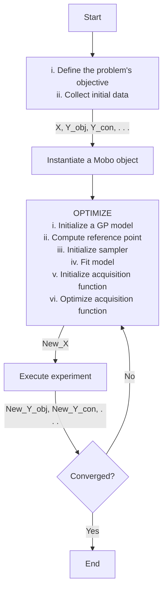

# pyBO — A Python Library for Bayesian Optimization

`pyBO` is a Python library for Bayesian Optimization of single and multi objective problems. Built on top of BoTorch and
using Gaussian
Processes as surrogate models, it provides a user-friendly framework for optimizing multiple competing objectives under
experimental constraints, and finding pareto-optimal solutions.

## Table of Contents

- [Key Features](#key-features)
- [Installation](#installation)
- [Experimental workflow](#experimental-workflow)
- [pyBO](#pybo-internal-workflow)
    - [Data Format](#data-format)
    - [Visualization](#visualization)
    - [Tutorials](#tutorials)
    - [Notes](#notes)

## Key Features

Version 0.1 currently supports:

- Multi-objective optimization problems for vector-valued functions $$\mathbf{f}_0: \mathbb{R}^N \to \mathbb{R}^m$$
  where $m = 2$ or $m = 3$.
- Batch mode (q-batch) for parallel evaluations.
- Linear equality constraints on the input domain (X).
- Linear inequality constraints on the input domain (X).
- Nonlinear inequality constraints on the input domain (X).
- Linear and non-linear inequality constraints on the output domain (Y).
- Observations noise (variance).
- The following Monte Carlo based acquisition functions: qEHVI, qLogEHVI, qNEHVI, qLogNEHVI, qDWNEHVI, qEWNEHVI,
  qNParEGO.
- Easy-to-write custom objectives, including trackers and penalization.
- Plotting of optimization results and metrics.
- Pythonic integration in experimental workflows.
- CUDA, Apple Metal Framework, and CPU.

## Installation

Currently, the package is only available for local installation.

1. Clone the repository:  `git clone https://github.com/BerriesLab/pybo`
2. Install required build tools (if not already installed):  `python -m pip install --upgrade build setuptools wheel`
3. Build the package:  `python -m build`
4. Install the package locally:  `pip install dist/pyBO-0.1.0-py3-none-any.whl`   (Replace
   pyBO-0.1.0-py3-none-any.whl with the actual filename in your dist/ folder)

## Experimental workflow

`pyBO` is designed to integrate seamlessly into any experimental optimization loop. A typical experimental optimization
problem starts with an initial dataset of (X, Y) pairs, which serve as the prior knowledge for the Bayesian
optimization. Based on this data, the Bayesian optimization suggests a new set of parameters, `new_X`. The user can then
run a new experiment using `new_X` to obtain new observables, including new objectives `new_Y_obj`, new constraint
values `new_Y_con`, and new tracker values `new_Y_track`. The new objective and constraint values, together with the `new
X`, are subsequently used to update the prior belief, by initializing a new Gaussian Process model. This model is then
optimized, and the process is repeated iteratively until a convergence criterion is satisfied.

```mermaid
flowchart TD
    A1[i. Define the problem's objective<br>ii. Collect initial data]
    A2[Instantiate a Mobo object]
    A3[OPTIMIZE<br>i. Initialize a GP model<br>ii. Compute reference point<br>iii. Initialize sampler<br>iv. Fit model<br>v. Initialize acquisition function<br>vi. Optimize acquisition function]
    A4[Execute experiment]
    A5{Converged?}
    Start --> A1
    A1 -->|X, Y_obj, Y_con, . . .| A2
    A2 --> A3
    A3 -->|New_X| A4
    A4 -->|New_Y_obj, New_Y_con, . . .| A5
    A5 -->|Yes| End
    A5 -->|No| A3
```

## pyBO

pyBO consists of the following packages:

- **constraints**: Handles constraint definitions for the optimization problem.
- **mobo**: A stateful class that manages the Bayesian optimization loop.
- **objectives**: classes designed to provide all information required by Mobo, including bounds, constraints,
  the reference point, and the target objectives to optimize. The optimization problem is defined in the original space,
  as is the reference point. By specifying the objective to minimize, Mobo automatically handles any necessary sign
  flips.
- **samplers**: Provides functionality for constrained sampling.
- **plotters**: Classes for visualizing optimization results and tracking parameter evolution.
- **utils**: Miscellaneous utility functions used across the package.

### Data Format

`pyBO`'s optimizer receives as input a matrix $\mathbf{Z}$:

$$\mathbf{Z} =
\begin{bmatrix}
\mathbf{X} &
\mathbf{Y}_{\mathrm{obj}} &
\mathbf{Y}_{\mathrm{obj},\sigma} &
\mathbf{Y}_{\mathrm{con}} &
\mathbf{Y}_{\mathrm{con},\sigma}
\end{bmatrix}$$

where

- $\mathbf{X} \in \mathbb{R}^{n \times d}$ is The input data matrix.
- $\mathbf{Y}_{\mathrm{obj}} \in \mathbb{R}^{n \times m}$ is the objective value matrix.
- $\mathbf{Y}_{\mathrm{obj, \sigma}} \in \mathbb{R}^{n \times m}$ is the objective variance value
  matrix (optional).
- $\mathbf{Y}_{\mathrm{con}} \in \mathbb{R}^{n \times c}$ is the constraint value matrix (optional).
- $\mathbf{Y}_{\mathrm{con, \sigma}} \in \mathbb{R}^{n \times c}$ is the constraint variance value
  matrix (optional).

and where

- $n$ is the number of observations.
- $d$ is the number of parameters or input space dimension.
- $m$ is the number of objectives.
- $c$ is the number of constraints.

`pyBO` allows exporting:

- The Mobo object as a binary file (pickle) for later reuse or analysis.

## Visualization

The current version of `pyBO` provides built-in tools to visualize:

- The pareto front for bi-objective optimization problems, where the objective function has the
  form $$\mathbf{f}_0: \mathbb{R}^N \rightarrow \mathbb{R}^2 \ \mathrm{or} \ \mathbb{R}^3$$
- The hypervolume spanned at each optimization cycle.
- The hypervolume improvement across optimization cycles.
- The optimization execution time per optimization cycle.
- The evolution as a function of optimization steps of:
    - parameters
    - objectives
    - constraints
    - trackers

## Tutorials

Explore the following examples to learn how to use `pyBO`, and make sure to review the corresponding objective
definitions.

- [Branin-Currin](tutorials/multi_objective/BraninCurrin.py): An unconstrained bi-objective optimization problem.
- [Linear Equality Test](tutorials/multi_objective/linear_equality_test.py): A linear equality input constrained
  bi-objective
  optimization problem.
- [Linear Inequality Test](tutorials/multi_objective/linear_inequality_test.py): A linear inequality input constrained
  bi-objective
  optimization problem.
- [Binh and Korn](tutorials/multi_objective/BinhKorn.py): A nonlinear inequality input constrained bi-objective
  optimization
  problem.
- [Osyczka-Kundu](tutorials/multi_objective/OsyczkaKundu.py): A liner and nonlinear inequality input constrained
  bi-objective
  optimization problem.
- [C2DTLZ2](tutorials/multi_objective/C2DTLZ2.py): An output constrained bi-objective optimization problem.

## Notes

- Sporadically, the following error has been observed: `RuntimeError: main thread is not in main loop Tcl_AsyncDelete:
  async handler deleted by the wrong thread`. This traceback appears to originate from the TkAgg backend, which depends
  on Tkinter. To suppress this error, `matplotlib` is imported with the appropriate backend configuration.
  Unfortunately, this approach prevents figures from being displayed on screen, meaning that `show()` will no longer
  function.
