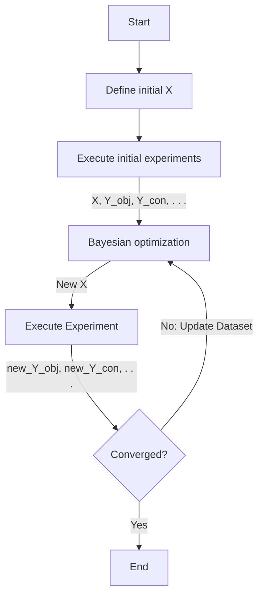
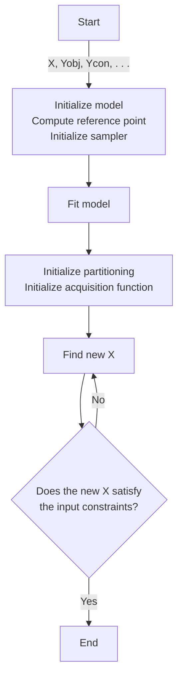

# pyBO — A Python Library for Bayesian Optimization

`pyBO` is a Python library for Multi-Objective Bayesian Optimization (MOBO). Built on top of BoTorch and using Gaussian
Processes as surrogate models, it provides a user-friendly framework for optimizing multiple competing objectives under
experimental constraints, and finding pareto-optimal solutions.

## Table of Contents

- [Key Features](#key-features)
- [Installation](#installation)
- [Experimental workflow](#experimental-workflow)
- [pyBO workflow](#pybo-internal-workflow)
- [Data Format](#data-format)
- [Visualization](#visualization)
- [Tutorials](#tutorials)

## Key Features

Version 0.1 currently supports:

- Multi-objective optimization problems for functions of the
  form $\mathbf{f}_0: \mathbb{R}^N \rightarrow \mathbb{R}^2, \mathbb{R}^3$.
- Batch mode (q-batch) for parallel evaluations.
- Linear equality constraints on the input domain (X).
- Linear inequality constraints on the input domain (X).
- Nonlinear inequality constraints on the input domain (X).
- Linear and non-linear inequality constraints on the output domain (Y).
- Observations noise (variance).
- The following acquisition functions: qEHVI, qLogEHVI, qNEHVI, qLogNEHVI, qDWNEHVI, qEWNEHVI, qNParEGO
- Easy-to-write custom objectives, including trackers and penalization.
- Plotting of optimization results and metrics.
- Pythonic integration in experimental workflows.

## Installation

The package is currently available only for local distribution. To install,
locally download the package in the dist/ folder, open the terminal and type:

`pip install pybo-0.1.0-py3-none-any.whl`

## Experimental workflow

`pyBO` is designed to integrate seamlessly into any experimental optimization loop. A typical experimental optimization
problem starts with an initial dataset of (X, Y) pairs, which serve as the prior knowledge for the Bayesian
optimization. Based on this data, the Bayesian optimization suggests a new set of parameters, `new_X`. The user can then
run a new experiment using `new_X` to obtain new observables, including new objectives `new_Y_obj`, new constraint
values `new_Y_con`, and new tracker values `new_Y_track`. The new objective and constraint values, together with the `new
X`, are subsequently used to update the prior belief, by initializing a new Gaussian Process model. This model is then
optimized, and the process is repeated iteratively until a convergence criterion is satisfied.


```mermaid
flowchart TD
    A[Define initial X]
    B[Execute initial experiments]
    C[Bayesian optimization]
    D[Execute Experiment]
    E{Converged?}
    Start --> A
    A --> B
    B -->|X, Y_obj, Y_con, . . .| C
    C -->|New X| D
    D -->|new_Y_obj, new_Y_con, . . .| E
    E -->|No: Update Dataset| C
    E -->|Yes| End
```

## pyBO Internal Workflow

pyBO consists of the following packages:

- constraints: Handles constraint definitions for the optimization problem.
- mobo: A stateful class that manages the Bayesian optimization loop.
- objectives: Objectives are designed to provide all information required by Mobo, including bounds, constraints, the
  reference point, and the target objective to minimize. The optimization problem is defined in the original space, as
  is the reference point. By specifying the objective to minimize, Mobo automatically handles any necessary sign flips.
- samplers: Provides functionality for constrained sampling.
- plotters: Classes for visualizing optimization results and tracking parameter evolution.
- utils: Miscellaneous utility functions used across the package.


```mermaid
flowchart TD
    A[Initialize model<br>Compute reference point<br>Initialize sampler]
    B[Fit model]
    C[Initialize partitioning<br>Initialize acquisition function]
    D[Find new X]
    E{Does the new X satisfy<br>the input constraints?}
    Start -->|X, Yobj, Ycon, . . .| A
    A --> B
    B --> C
    C --> D
    D --> E
    E -->|Yes| End
    E -->|No| D


```

## Data Format

### Data Input Format

Input to the optimizer is provided as a matrix $\mathbf{Z}$ in a CSV file:

$$\mathbf{Z} =
\begin{bmatrix}
\mathbf{X} &
\mathbf{Y}_{\mathrm{obj}} &
\mathbf{Y}_{\mathrm{obj},\sigma} &
\mathbf{Y}_{\mathrm{con}} &
\mathbf{Y}_{\mathrm{con},\sigma}
\end{bmatrix}$$

where

- $\mathbf{X} \in \mathbb{R}^{n \times d}$: The input data matrix.
- $\mathbf{Y}_{\mathrm{obj}} \in \mathbb{R}^{n \times m}$: The objective
  value matrix.
- $\mathbf{Y}_{\mathrm{obj, \sigma}} \in \mathbb{R}^{n \times m}$: The Variance
  of the objective value matrix (optional).
- $\mathbf{Y}_{\mathrm{con}} \in \mathbb{R}^{n \times c}$: The constraint
  value matrix (optional).
- $\mathbf{Y}_{\mathrm{con, \sigma}} \in \mathbb{R}^{n \times c}$: The variance
  of the constraint value matrix (optional).

and where

- $n$ is the number of observations.
- $d$ is the number of parameters or input space dimension.
- $m$ is the number of observable objectives.
- $c$ is the number of observable constraints.

### Data Output Format

`pyBO` allows exporting:

- The optimizer states as a binary file (pickle) for later reuse or analysis.
- The full dataset $\mathbf{Z}$ as a CSV file, matching the input format.

## Visualization

`pyBO` provides built-in tools to visualize:

- The Pareto front in bi-objective optimization problems, where the objective function is of the
  form $\mathbf{f}_0: \mathbb{R}^N \rightarrow \mathbb{R}^2$.
- The hypervolume achieved at each optimization cycle.
- The memory usage during each optimization cycle.
- The execution time for each optimization cycle.

## Tutorials

Explore the following examples to understand how `pyBO` can be applied:

- [Branin-Currin](tutorials/BraninCurrin.py): An unconstrained bi-objective optimization problem.
- [C2DTLZ2](tutorials/C2DTLZ2.py): A constrained bi-objective optimization problem.
- [Binh and Korn](tutorials/BinhKorn.py): A constrained bi-objective optimization problem.

## Custom Multi Objective Functions

A custom multi objective function must inherit from ```BaseTestProblem, ABC```, and must include the following
attributes:

- ```self.ref_point```
- ```self.negate```
- ```evaluate_true```: this is the true objective. It must always be cast in its original form. If the objectives is
  something to minimize, this must be written in its minimization form, as ```self.negate``` will flip its sign when
  required in the ```forward``` method.
- ```evaluate_slack```
- this affects the sign of ```self.ref_point``` and of the objective function ```f``` in the ```forward``` method.
  Therefore,