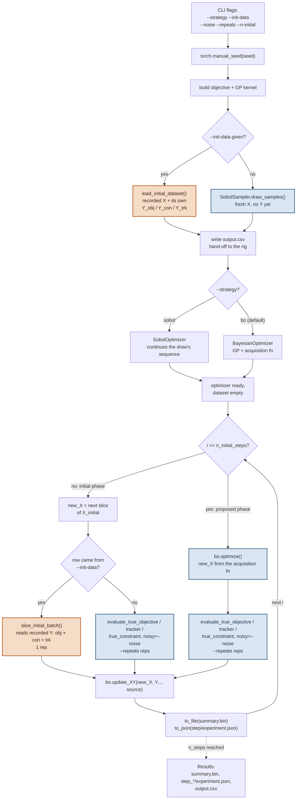

# IFormAC

A constrained multi-objective BO trial against a polynomial surrogate of an I-form
electrical discharge machining (EDM) process. Constrained sibling of
[`vformac`](../vformac) - same script shape, plus one column: a measured constraint.

## What it models

**Parameters**

| Label | Unit | Bounds | Resolution |
|---|---|---|---|
| `Maximum Current` | A | 7.5 – 15.0 | 0.1 |
| `Pedestal Current` | A | 3.0 – 7.5 | 0.1 |
| `Maximum Ramp Time` | ns | 7 800 – 78 000 | 1 |

**Objectives**

| Label | Unit | Sense | Reference point |
|---|---|---|---|
| Material Removal Rate | mm³/min | maximize | 0 |
| Tool Wear | µm | minimize | 160 |

**Constraint** - Orbiting Time Deviation (min): how far the measured orbiting time
falls outside a target band, `0` while inside it and feasible at `<= 0`. The band is
`target +/- delta`, with `target` the mean of three reference orbiting times
(~21.81 min) and `delta = target * 10%`.

**Tracker** - Orbiting Time (min): the measurement itself, recorded separately because
the constraint column holds a distance rather than the raw value.

## Running it

```bash
# A single BO trial
python -m tutorials.multi_objective.iformac.main --n-evals 32 --seed 2063

# The Sobol baseline, same seed - the two arms start from the same fresh initial design
python -m tutorials.multi_objective.iformac.main --strategy sobol --n-evals 32 --seed 2063

# Warm-start both arms from a previously recorded run's own initial design - e.g. the
# real, converted rig data in data/iformac_converted - so a comparison isolates the
# search strategy rather than which points the design drew
python -m tutorials.multi_objective.iformac.main --strategy bo    --init-data data/iformac_converted --n-evals 32 --seed 7
python -m tutorials.multi_objective.iformac.main --strategy sobol --init-data data/iformac_converted --n-evals 32 --seed 7

# --n-initial then keeps only the first that many recorded points, the same one subset
# every time. Add --shuffle-init to have --seed also reorder them first, so sweeping
# --n-initial (e.g. via studies.variability_study) asks "does a smaller warm start reach
# the same hypervolume", each replicate over a different random subset of the real design
# rather than always its first --n-initial points
python -m tutorials.multi_objective.iformac.main --init-data data/iformac_converted --shuffle-init true --n-initial 8 --seed 7
```

See `pybo.utils.cli.build_trial_args_parser` for the full flag list
(`--n-evals`, `--q-batch`, `--noise`, `--repeats`, `--n-initial`, `--init-data`,
`--shuffle-init`, `--seed`, `--output-dir`, `--device`, `--strategy`, `--verbose`). For a
replicated comparison across seeds, drive this same script through
`studies.variability_study` instead of calling it directly.

## What it writes

| Path | Contents |
|---|---|
| `output.csv` | The initial design, in the parameters' real units - a flat hand-off for whoever (or whatever machine control software) actually sets these points on the rig. |
| `summary.bin` | The running `OptimizerBase` state for the whole campaign, rewritten after every measurement. |
| `step_NNN_repRR/experiment.json` | One record per measurement, tagged `"source": "initial"` or `"proposed"`. This is exactly what `--init-data` reads back on a later run. |

## Control flow



Legend: **copper** boxes read data back from a previous run and never recompute it;
**blue** boxes draw a fresh point or evaluate it through the ground truth.

The two setup-time forks (`--init-data`, `--strategy`) each resolve once, before the
loop starts. Inside the loop, every step re-asks whether it's still in the initial
phase, and - only while it is - whether that phase came from `--init-data`. A proposed
point is never loaded: the optimizer just chose it, so nothing on disk has measured it
yet. Either way, every path - including the constraint, evaluated alongside the
objective and tracker from the same measured orbiting time - rejoins at the same
`bo.update_XY()` call before the run saves its state and moves to the next step.