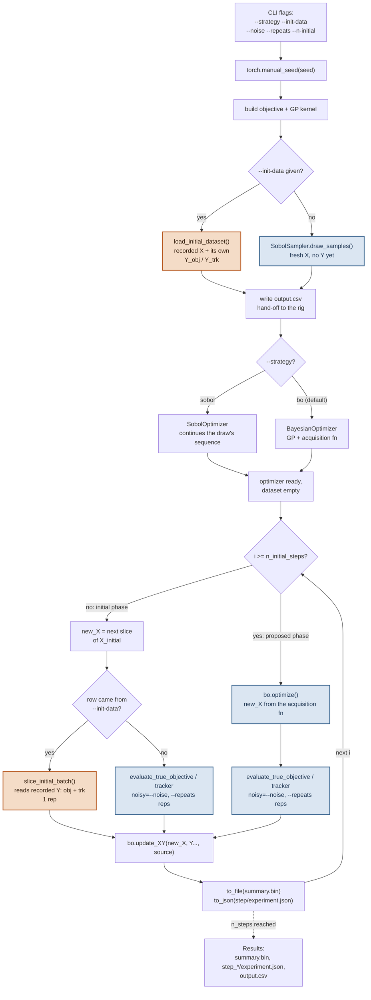

# VFormAC

A multi-objective BO trial against a polynomial surrogate of a V-form electrical
discharge machining (EDM) process. Unconstrained sibling of [`iformac`](../iformac) -
same script shape, minus the constraint column.

## What it models

**Parameters**

| Label | Unit | Bounds | Resolution |
|---|---|---|---|
| `V0` | V | 60 – 120 | 1 |
| `dV` | V | 60 – 85 | 1 |
| `td1` | ns | 16 200 – 25 920 | 1 |
| `td2` | ns | 12 960 – 42 120 | 1 |

`V0` is the initial voltage; `dV` is twice the voltage step (each step rises by
`dV / 2`); `td1`/`td2` are the two delay times. The bounds on `td1`/`td2` are fractions
of `t_r = t_d100 * (1 - c / 50)`, with `t_d100 = 54 000 ns` and `c = 20`.

**Objectives**

| Label | Unit | Sense | Reference point |
|---|---|---|---|
| Material Removal Rate | mm³/min | maximize | 0 |
| Tool Wear | µm | minimize | 150 |

**Tracker** - Orbiting Time (min): measured and recorded, not optimized.

**Search-space constraints** (respected when proposing a point, not measured):
- `V0 + dV <= 150`
- `1.2 * t_r <= td1 + td2 <= 1.8 * t_r`

## Running it

```bash
# A single BO trial
python -m tutorials.multi_objective.vformac.main --n-evals 32 --seed 2063

# The Sobol baseline, same seed - the two arms start from the same fresh initial design
python -m tutorials.multi_objective.vformac.main --strategy sobol --n-evals 32 --seed 2063

# Warm-start both arms from a previously recorded run's own initial design, so a
# comparison isolates the search strategy rather than which points the design drew
python -m tutorials.multi_objective.vformac.main --strategy bo    --init-data <path-to-a-run> --n-evals 32 --seed 7
python -m tutorials.multi_objective.vformac.main --strategy sobol --init-data <path-to-a-run> --n-evals 32 --seed 7
```

See `pybo.utils.cli.build_trial_args_parser` for the full flag list
(`--n-evals`, `--q-batch`, `--noise`, `--repeats`, `--n-initial`, `--init-data`, `--seed`,
`--output-dir`, `--device`, `--strategy`, `--verbose`). For a replicated comparison across
seeds, drive this same script through `studies.variability_study` instead of calling it
directly.

## What it writes

| Path | Contents |
|---|---|
| `output.csv` | The initial design, in the parameters' real units - a flat hand-off for whoever (or whatever machine control software) actually sets these points on the rig. |
| `summary.bin` | The running `OptimizerBase` state for the whole campaign, rewritten after every measurement. |
| `step_NNN_repRR/experiment.json` | One record per measurement, tagged `"source": "initial"` or `"proposed"`. This is exactly what `--init-data` reads back on a later run. |

## Control flow



Legend: **copper** boxes read data back from a previous run and never recompute it;
**blue** boxes draw a fresh point or evaluate it through the ground truth.

The two setup-time forks (`--init-data`, `--strategy`) each resolve once, before the
loop starts. Inside the loop, every step re-asks whether it's still in the initial
phase, and - only while it is - whether that phase came from `--init-data`. A proposed
point is never loaded: the optimizer just chose it, so nothing on disk has measured it
yet. Either way, every path rejoins at the same `bo.update_XY()` call before the run
saves its state and moves to the next step.